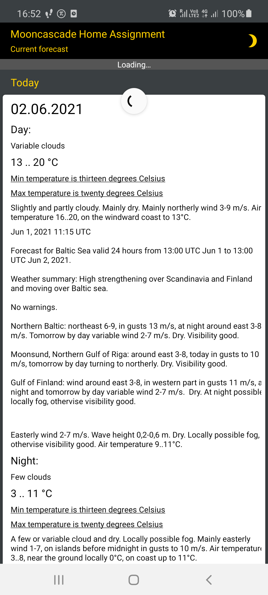
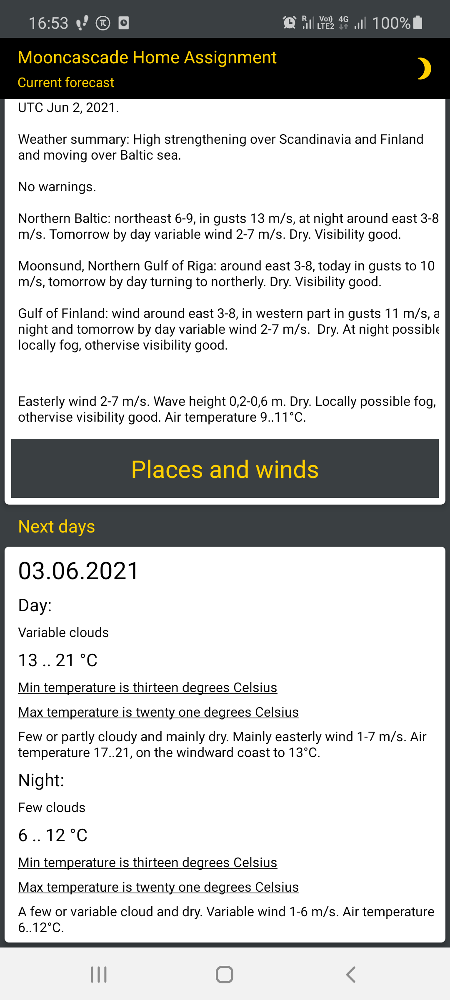
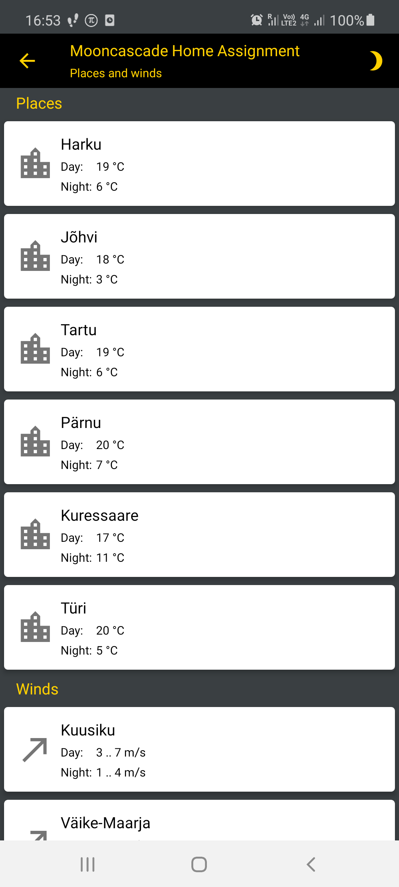
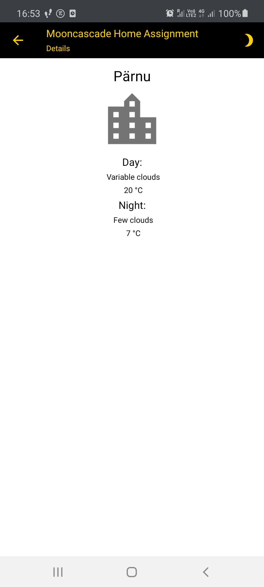
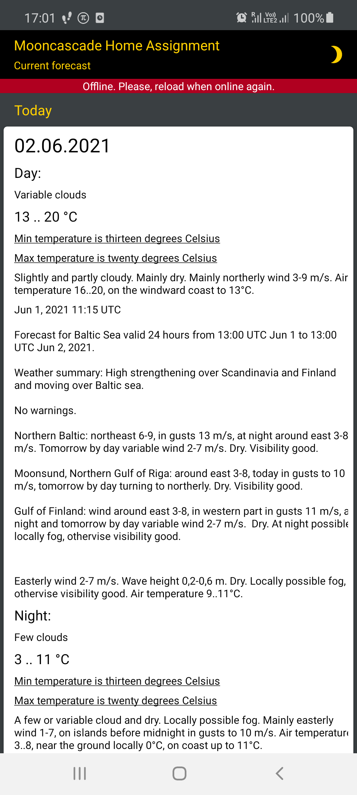
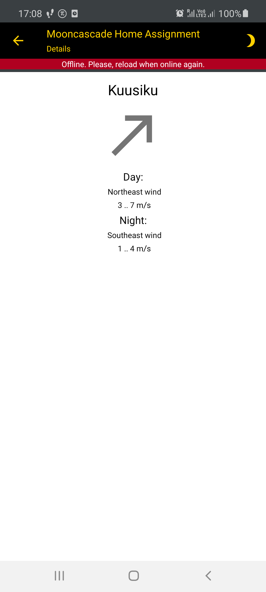

## It is a home assignment for <a href="https://mooncascade.com/">Mooncascade</a> made by Stanislav Sobol (stanislav.i.sobol@gmail.com)

## What additional task I have chosen

### Caching and offline work
Because it is an usual way I develop any app, which receives data from the REST API. All the data goes immediately to the local DB and can be read from there reactively.

### Animations
Because it is familiar to me and nice to implement. The app's toolbar elements are animated as long as the fragments' navigation process.

### Display temperature as words
Because it could be possibly to apply TDD approach in this case.

### Not chosen task
I did not choose the task about icons because this task is not fully determined: I do not know what exact word I can encounter in the forecast in order to show this or that icon.
There is no any clear condition, clear type, key or something.

## What I have done on top of the main task

1. The app shows different statuses like "Loading...", "Offline. Please, reload when online again" as well as erros messages.
2. I added a button in form of the crescent leading to Mooncascade home site.
3. I added also info about winds in the screen of places (towns and cities0)
4. I added the detailed info about a wind.
5. I implemented the swipe-to-refresh techiq to refresh the data from the REST API.
6. I tried to adhere to Mooncacade brand color palette.

## Screenshots

